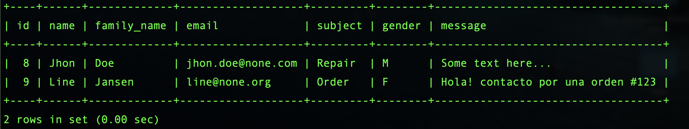

## Projet: Formulaire en Python avec Flask

[Description Project here](Flask_EN.md)

### First steps

### Virtual Enviroment

		mkdir Flask
		cd Flask
		python3 -m venv .Flask01
		
		activate 
		. .Flask01/bin/activate
		

### Packages Installed

	pip install flask
	pip install Flask-Bootstrap
	pip install Flask-WTF
	pip install MarkupSafe
	pip install bleach
	
**Flask-WTF:** An extension that integrates Flask with the WTForms library, making it easier to work with web forms.

**Flask:** The core Flask package that provides the web application framework.

**Flask-Bootstrap:** An extension that integrates Bootstrap with Flask, allowing you to use Bootstrap's CSS and components in your templates.

**MarkupSafe:** A library used by Jinja2 for escaping and sanitizing user input to prevent XSS attacks.	

**Bleach (optional):** A library for sanitizing and cleaning user input of HTML and other potentially harmful content.

[Page Web official](https://getbootstrap.com/)
	
	

## Flask

Flask is a lightweight Web Server Gateway Interface (WSGI) web application framework. It has minimal or no external libraries. It is used to create a simple website and then scale it up to complex applications.

**Implementation of Flask**

Before implementing Flask, we will just take a look at our project structure.

	Flask_01/
	├── app.py
	├── config.py
	├── templates/
	│   ├── index.html
	├── static/
	│   └── img/
	    └─ styles.css
	
	
	
	
## app.py
This is the main Flask application file where you I define the routes and handle requests.

[code Here](app.py)
	
	
In this code block, you import the Flask class and the render_template() function from the flask package. You use the Flask class to create your Flask application instance named app. Then you define a view function (which is a Python function that returns an HTTP response) called home() using the app.route() decorator, which converts a regular function into a view function. This view function uses the render_template() function to render a template file called index.html.	
	
## Jinja

[Ressources:](https://www.digitalocean.com/community/tutorials/how-to-use-templates-in-a-flask-application)

[Documentation Jinja Template](https://jinja.palletsprojects.com/en/3.1.x/)
	
##Run app.py

	python app.py
	
	running on http://localhost:5000/
	
## Validation of a form	 with Flask-WTF

	pip install Flask Flask-WTF
	
	
You import the following fields from the WTForms library:

	StringField: A text input.
	TextAreaField: A text area field.
	IntegerField: A field for integers.
	BooleanField: A checkbox field.
	RadioField: A field for displaying a list of radio buttons for the user to 	choose from.
		
In the line from **wtforms.validators import InputRequired, Length,** you import validators to use on the fields to make sure the user submits valid data. **InputRequired** is a validator you’ll use to ensure the input is provided, and Length is for validating the **length** of a string to ensure it has a minimum number of characters, or that it doesn’t exceed a certain length.

## Configuration CSRF Protection in app.py

[Cross-site request forgery](https://owasp.org/www-community/attacks/csrf) 
*Malicious website exploit where unauthorized commands are transmitted from a trusted user*

**Overview**

Cross-Site Request Forgery (CSRF) is an attack that forces an end user to execute unwanted actions on a web application in which they’re currently authenticated. With a little help of social engineering (such as sending a link via email or chat), an attacker may trick the users of a web application into executing actions of the attacker’s choosing. If the victim is a normal user, a successful CSRF attack can force the user to perform state changing requests like transferring funds, changing their email address, and so forth. If the victim is an administrative account, CSRF can compromise the entire web application.

	from flask_wtf.csrf import CSRFProtect ##To enable CSRF protection globally for a Flask app, register the CSRFProtect extension.
	
	app = Flask(__name__)
	app.config.update(
	    DEBUG=True,
	    
	)
	
	csrf = CSRFProtect(app)
	csrf.init_app(app)

CSRF protection requires a secret key to securely sign the token. By default this will use the Flask app’s SECRET_KEY. If you’d like to use a separate token you can set **WTF _ CSRF _ SECRET _ KEY.** it generates a token randomly

		

#SQL

**[raw code](app.py)**

Installation the MySQL 

	brew install mysql

###Package

pip install mysql-connector-python
	
	CREATE DATABASE contact;
	mysql> use contact;

	mysql> create table contact_messages (
	    -> id INT AUTO_INCREMENT PRIMARY KEY,
	    -> name VARCHAR(100) NOT NULL,
	    -> family_name VARCHAR(100) NOT NULL,
	    -> email  VARCHAR(100) NOT NULL,
	    -> subject  VARCHAR(100) NOT NULL,
	    -> gender  VARCHAR(100) NOT NULL,
	    -> message TEXT NOT NULL);
	    

	
## config.py

Securing sensitive information like database credentials is essential in any application. To enhance the security of my project, I moved the MySQL configuration to a separate file. This practice helps keep my credentials out of version control and prevents accidental exposure.

	

## Result
[**HTML HERE**](templates/index.html)

##NOSQL 
[Tutorial from Digital Ocean](https://www.digitalocean.com/community/tutorials/how-to-use-mongodb-in-a-flask-application)

First step

	pip install Flask pymongo 
	
	

	
	

