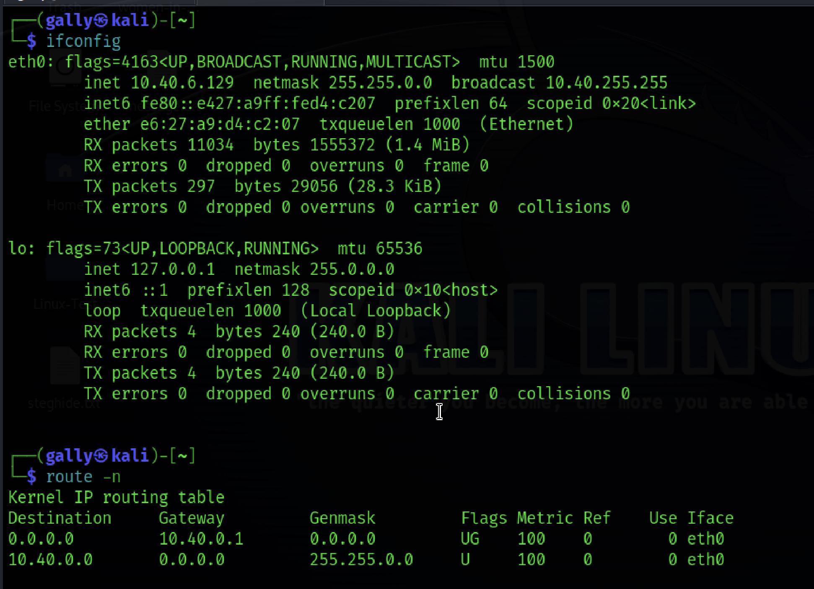
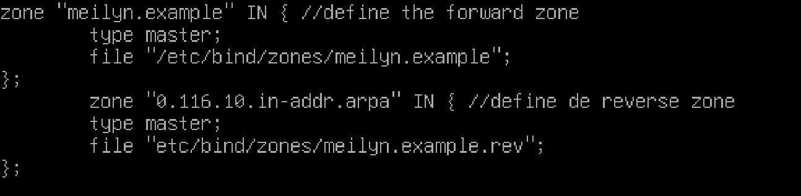
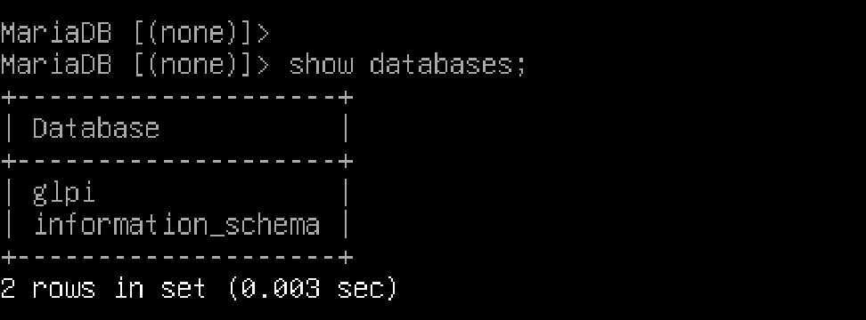
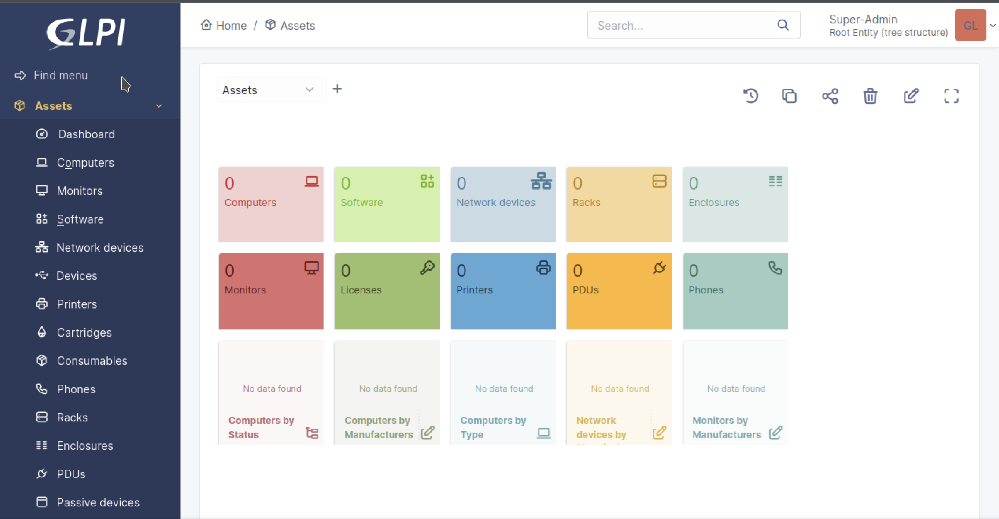
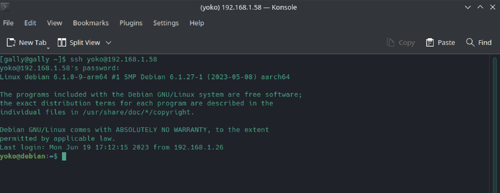
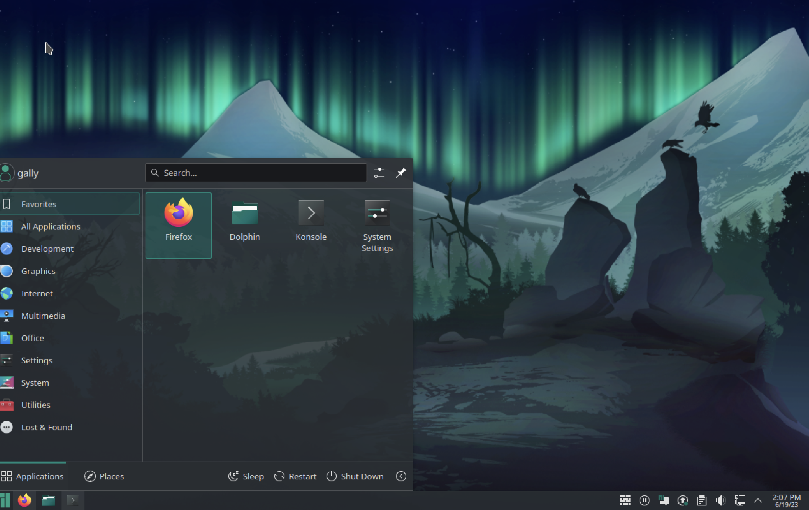

# Linux network services
## Project context

The local library in your little town has no funding for Windows licenses so the director is considering Linux. Some users are sceptical and ask for a demo. The local IT company where you work is taking up the project and you are in charge of setting up a server and a workstation. To demonstrate this setup, you will use virtual machines and an internal virtual network (your DHCP must not interfere with the LAN).

You may propose any additional functionality you consider interesting.

##Must Have
Set up the following Linux infrastructure:

   1. One server (no GUI) running the following services:
        
       * DHCP (one scope serving the local internal network) isc-dhcp-server 
       * DNS (resolve internal resources, a redirector is used for external 			resources) bind
       * HTTP+ mariadb (internal website running GLPI) 
        Required
        * Weekly backup the configuration files for each service into one single 		compressed archive
        * The server is remotely manageable (SSH)
        Optional
        * Backups are placed on a partition located on separate disk, this partition must be mounted for the backup, then unmounted

  2. One workstation running a desktop environment and the following apps:
        
       * LibreOffice
       * Gimp
       * Mullvad browser
        
       Required
       
      * This workstation uses automatic addressing
      * The /home folder is located on a separate partition, same disk
        Optional
      * Propose and implement a solution to remotely help a user

## Set up Debian Server

- I created a new user account with regular account privileges.  
	
		sudo useradd g***
		sudo passwd ****
		
- I upgraded the current packages of the Debian system. Because It may be the server is built with the old image file. The Debian team keeps working to enhance server security and provide updated packages regularly.	
	
		sudo apt upgrade 	
		
- I configured System’s Hostname identity for computer networks. It helps users and network machine to easily recognize a machine within a network in a human-readable format.
 
		hostnamectl 
		sudo hostnamectl set-hostname debianServer
		
- By default, Debian doesn’t have a firewall installed so I installed one 
	
		apt update
		apt install ufw
		sudo ufw enable
		
- I set default policies:
	
		sudo ufw default deny incoming
		sudo ufw default allow outgoing	
		sudo ufw reload
		ufw allow SSH	
		ufw status verbose		
		ufw enable
		
"port 53 DNS static IP"
		
_Note: later you will probably need to adjust the firewall settings to allow traffic in from other services that you install; example for Nginx: `sudo ufw allow 'Nginx Full'`._

You can now close the connection to the server with `exit`.****

# Harden SSH

* Using this file I set up my computer. 
[Server Hardenning](Server_hardenning.md) 

VM configuration: host IP 10.0.2.2/24
manually assigning IP address ifconfig enp0s1 10.0.2.3 netmask 255.255.255.0

# Installing DHCP SERVER

I followed this tutorial : [How to install DHCP Server] (https://www.youtube.com/watch?v=1csFmQeXHlg)

	sudo apt install -y isc-dhcp-server

### /etc/default/isc-dhcp-server

I Added configuration for DHCPDv4. INTERFACESv4 is a network interface name which is connected to a network which you try to provided DHCP. 
		
		sudo nano etc/default/isc-dhcp-server 
		
		INTERFACESv4=enp0s1
		
### /etc/dhcp/dhcpd.conf 

	sudo nano /etc/dhcp/dhcpd.conf 
	
###	A sligthly different configuration for an internal subnet
using [IP Calculator](https://www.calculator.net/ip-subnet-calculator.html?cclass=any&csubnet=16&cip=10.40.6.125&ctype=ipv4&printit=0&x=34&y=22) I calculated the next settings. 

	sudo systemctl restart isc-dhcp-server
	
			
### Netstat

Installation of Netstat on my Debian Server

		sudo apt install net-tools

Verification the network with netstat to check the port udp is listening on port : 67 

	sudo netstat -anp | grep dhcp

### Firewall 
- I added port 67 on my firewall 

		sudo ufw allow 67/udp

- check status

		sudo ufw status
		
### Kali Machine
	ifconfig
	route -n 
	
 

Everything is working! (yay) 

Printed  active DHCP leases.

	sudo dhcp-lease-list	

IP static 

https://www.cyberciti.biz/faq/add-configure-set-up-static-ip-address-on-debianlinux/

apt install network-manager

# DNS

### Installing BIND9

BIND (Berkeley Internet Name Domain) is an implementation of the DNS protocol. In BIND 9, several number of major enhancements have been made, including IPv6 support, much more flexible configuration and control, improved caching performance, EDNS0 support for larger UDP responses, and better management over dynamically assigned IP addresses. 	

	sudo apt install bind9 bind9utils bind9-doc
	
The **bind9utils** are utilities for managing BIND configuration and are named the command used to control BIND from the command line.

**Note:** bind9-doc is a documentation package for BIND software.

Check it out bind status 	

	sudo systemctl status bind9

Checked out the BIND SERVERS LISTENS 

	sudo netstat -lnptu | grep named
	
### Configuring BIND9

By default, BIND is configured to serve the localhost only. This means that any request that comes from outside your server will be rejected by BIND itself unless you have it properly configured.

First, I set the DNS server to listen to all IP addresses to send requests to the DNS server from various places: From the server, from a different network, or when you are using the Internet.	

	cd /etc/bind

	sudo nano named.conf.options

	Let's replace listen-on {127.0.0.1;};

	by

	listen-on {any;};

	listen-on-v6 { any; }
	
	##exit
	
	sudo service bind9 restart
	sudo service bind9 status
	
	
### Creating Forward Lookup Zones 

They map a domain name to an IP address and are used in resolving domain names to IP addresses for email, web pages, etc.

I edited the “/etc/bind/named.conf.options” file to declare a forward zone.
with the following code 

### named-checkconf /etc/bind/named.conf.options

	// allow only LAN traffic from 10.40.0.0-10.40.0.30
	acl LAN {
		10.40.0.0/16;
	};
	options {
        directory "/var/cache/bind"; // default directory
        allow-query { localhost; LAN; }; // allow queries from localhost and 			10.40.0.0-10.40.0.30
        forwarders { 1.1.1.1; }; // use CloudFlare 1.1.1.1 DNS as a forwarder
        recursion yes;  // allow recursive queries
	};
	
check the syntax of the file with : 

	sudo named-checkconf named.conf.options
	
### Edit the named.conf.local file

The named.conf.local is typically used to define local DNS zones for a private domain. We will update this file to include our forward and reverse DNS zones.

		
Check the syntax 

	sudo named-checkconf /etc/bind/named.conf.options
	
### Create a directory for your zone files

Create a directory to store the zone files we specified in the previous step.

	sudo mkdir /etc/bind/zones
	
### Create the forward zone file

	cp /etc/bind/db.local /etc/bind/zones/meilyn.org	
open 

	sudo nano meilyn.org
	
--	
	

	$TTL    604800
	; SOA record with MNAME and RNAME updated
	@       IN      SOA     meilyn.org. root.meilyn.org. (
                              3         ; Serial Note: increment after each change
                         604800         ; Refresh
                          86400         ; Retry
                        2419200         ; Expire
                         604800 )       ; Negative Cache TTL
	; Name server record 
	@       IN      NS      bindserver.meilyn.org.
	; A record for name server
	bindserver      IN      A       10.40.6.125
	; A record for clients
	client1      IN      A       10.40.0.3
	client2      IN      A       10.40.0.4 

check the configuration:

	named-checkzone meilyn.org /etc/bind/zones/meilyn.org
	
### Create the reverse zone file

Now, we'll create a corresponding reverse zone file /etc/bind/zones/meilyn.org.rev. The reverse zone file allows the Bind DNS server to resolve IP addresses (like 10.40.6.3) to names (like bindserver.meilyn.org).

First, copy the default db.local zone file to /etc/bind/zones/meilyn.org.rev

	$TTL    604800
	; SOA record with MNAME and RNAME updated
	@       IN      SOA     meilyn.org. root.meilyn.org. (
	                              2         ; Serial Note: increment after each change
	                         604800         ; Refresh
	                          86400         ; Retry
	                        2419200         ; Expire
	                         604800 )       ; Negative Cache TTL
	; Name server record 
	@       IN      NS      bindserver.meilyn.org.
	; A record for name server
	bindserver      IN      A       10.40.6.125
	; PTR record for name server
	2   IN      PTR     bindserver.meilyn.org
	; PTR record for clients
	3   IN      PTR     client1.meilyn.org
	4   IN      PTR     client2.meilyn.org
	
Once the changes are complete, use the named-checkzone command to check the configuration:

	sudo named-checkzone meilyn.org /etc/bind/zones/meilyn.org.rev
	
Restart BIND 9

	sudo systemctl restart bind9
		
	
###	 Configure clients to use the configuration

Once my Private Bind DNS server is configured, I can configure the clients to use it. 

First, check which interface is used for LAN connectivity

	ip -brief addr show to 10.40.0.0/16
	
	R= enp0s1   UP  10.40.6.125/16
	
	
## HTTP+ Maria

Sources

[Install Apache2 On debian Server](https://kifarunix.com/install-apache-web-server-on-debian-12/)

	
[Install Mariadb on Debian 12](https://kifarunix.com/install-mariadb-10-on-debian-12/)
	
Securing MariaDB 10
	
	MariaDB comes with a default security script, mariadb-secure-installation that is used to improve the security of MariaDB installation by:

    Setting the password for root accounts (if need be).
    Disabling remote root login to the databases.
    Removing anonymous-user accounts.
    Removing the test database, which by default can be accessed by anonymous users.
    
    
   Login 
   
 		mariadb
 		Or;
 		sudo -u mysql mariadb	

Verify MariaDB Server
	
	ps -ef | grep -i mysql
	
the MariaDB server is listening on localhost only for security reasons. You can check it with the following command:

	netstat -ant | grep 3306	
	
	ufw allow mysql 
	
[Configuration of the Maria DataBase] 
(https://webdock.io/en/docs/how-guides/database-guides/how-enable-remote-access-your-mariadbmysql-database)	

# Grant Access to a User

	MariaDB [(none)]> CREATE DATABASE glpi;
	MariaDB [(none)]> CREATE USER  'glpi'@'localhost' IDENTIFIED BY 	'password';
	MariaDB [(none)]> GRANT ALL ON glpi.* to 'wpuser'@'localhost' IDENTIFIED 	BY 'password_*********' WITH GRANT OPTION;
	MariaDB [(none)]> FLUSH PRIVILEGES;
	MariaDB [(none)]> EXIT;
	
## Access to MySQL

	sudo mysql -u 'user' -p 
	enter password 
	
	show databases;
	
	
	
##Installing GLPI

Just download the software and make sure Mariabd + php + Mysql were installed.

Followed this tutorial 
(https://www.youtube.com/watch?v=X3jbo6rFntI)

* Installation of PHP extensions required by GLPI

		sudo apt install -y php-curl php-zip php-gd php-intl php-intl php-pear 		php-imagick php-imap php-memcache php-pspell php-tidy php-xmlrpc php-xsl 		php-mbstring php-ldap php-ldap php-cas php-apcu libapache2-mod-php php-		mysql php-bz2
		
* Download GLPI on my system /var/www/html

		sudo w-get (https://glpi-project.org/download/)
		sudo tar -xvf glpi....tgz
		
* Change permissions on the GLPI folder 

		sudo chmod 755 -R glpi
		sudo chown -R www-data:www-data glpi

* restart Apache
	
		sudo systemctl restart apache2
		
* Access Address 
	
		http://IP_SERVER/glpi
		
* Installation GLPI on my server
		

[GLPI PROJECT](https://glpi-project.org/)	
View of my GLPI from my Manjaro workstation

## The server is remotely manageable (SSH)

# Weekly backup
##Installing Rsync 

rsync is fast, versatile, remote (and local) file-copying tool. 

Installed on my debian server and Manjaro remote machine

	sudo apt -y install rsync (Debian Server)

Manjaro

	Enable snapd 
	sudo pacman -S snapd
	
to enable classics snap support I created a symbolic link between 
	/var/lib/snapd/ snap and /snap
	
	sudo systemctl enable --now snapd.socket
	sudo ln -s /var/lib/snapd/snap /snap
	
Installing Rsync on Manjaro
	
	sudo snap install rsync	
	

With tar

	tar -zcf ~/backups/daily/backup-$(date +%Y%m%d).tar.gz -C /var/www/ glpi

rsync delete +7 days + remote machine

	rsync -a --delete /root/backups/ gally@192.168.1.59:~/backups
	
Create a folder with the name backup on the home directory of my Remote Machine.
			 
	

# Workstation

[Plasma Desktop Download](https://manjaro.org/download/)

## Linux Manjaro

I installed linux   because it's a system that ≠ user privacy and control of their hardware and it provides numerous customization options and applications, as well as security and privacy features. It also offers several graphical user interfaces.

Over the years, Manjaro Linux was recognized as a desktop easy to set up and use, suitable for both beginners and experienced users.

* Plug & Play Hardware 
* Rolling release 
* Wide range of software 
* Secure by default 
* Lightning fast 

### User's interface plasma Desktop

### Installing Libre Office

	sudo pacman -Sy libreoffice-fresh
	
### Installing Gimp 

	pamac install gimp
	
	
	

		
		 
		

		
		
