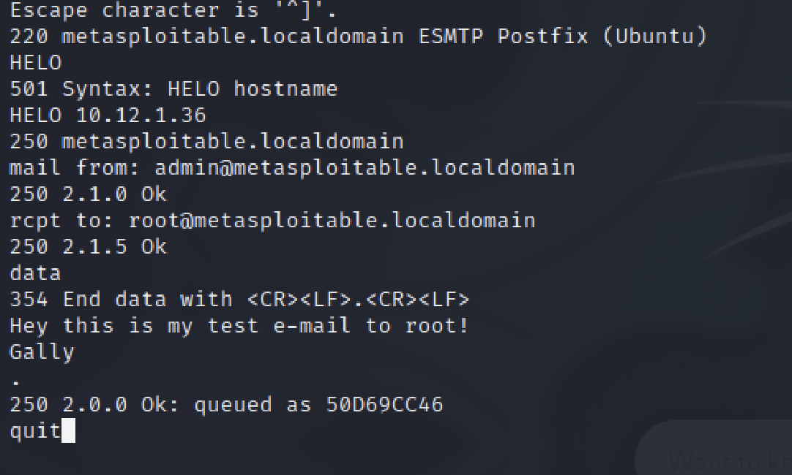

# Smtp  enumeration 

## What is a smtp server?
An "SMTP server" is a mail server that routes emails over the Internet from a sender to one or more recipients according to the rules of the SMTP network protocol. An important function of the SMTP server is to prevent spam by means of authentication mechanisms, by which it is only possible to send emails to authorized users. For this purpose, most modern mail servers support the ESMTP protocol extension with SMTP-AUTH.

As relays, SMTP servers are an essential link in the email transmission process, which involves several servers: the sender's outgoing mail server, one or more external transfer servers and the recipient's incoming mail server.

### Outgoing mail server of the sender.
As soon as the sender has sent his email, the Webmail application of his provider or email program (the SMTP client, also called "Mail User Agent" or MUA) converts it into a header and a body and loads it onto the outgoing mail server: an SMTP server. This server then has a "Mail Transfer Agent" (MTA), which is the software basis for sending and receiving emails. The MTA checks the mail for size and spam and then logs it. In order to lighten the load on the MTA, a Mail Submission Agent (MSA) is sometimes installed upstream, which checks the validity of the mail in advance. The MTA then searches for the IP address of the recipient mail server in the Domain Name System (DNS).

### External transfer server
If the recipient's domain is connected to the same mail server as the sender, then the email is delivered directly. However, if this is not the case, the MTA breaks it down into small data packets that are transmitted to the target SMTP server via the shortest and at the same time lowest traffic route. Packets sometimes pass through several MTAs on external SMTP servers (called "Relay" in technical jargon), which take over the continuous transfer.

### Recipient's incoming mail server
Upon arrival at the target SMTP server, the data packets are reassembled into a complete email. The MSA and/or MTA checks it once more for spam and then transfers it to the inbox server's message store. From there, the Mail Delivery Agent (MDA) forwards it to the recipient's inbox. Then other network protocols, IMAP or POP3, download the emails to the recipient's SMTP client.

Technically, it would also be possible to send emails directly from the sender's SMTP client to the recipient's client. However, using an SMTP server offers a clear advantage: If the recipient's incoming mail server is busy or temporarily down and the email cannot be delivered, the responsible SMTP server automatically attempts to deliver the email at regular intervals. This then happens until the delivery is successful or the email is finally returned to the sender as undelivered.

## Read this documentation 
https://pentestmonkey.net/tools/user-enumeration/smtp-user-enum

## Walkthrough
1. Installation in Kali

		sudo apt install smtp-user-enum 
		
2. create/download an user.txt list with potential usernames
3. smtp enumeration 

		smtp-user-enum -U <username_file> -M VRFY -t <IP_MACHINE> -p <25>
			
	```
<username_file>: Specify a file containing a list of usernames you want to 
	test.
<method>: Choose the enumeration method (commonly "VRFY" or "RCPT").
<target>: Specify the target SMTP server's IP address or hostname.
<port>: Specify the SMTP port (usually 25 for plaintext, 587 for encrypted, for 465 for SSL/TLS).
	    
	```

4. Connect to telnet to check which SMTP commands are supported

		telnet <smtp_server> 25
		
5. Once connected, I could manually enter SMTP commands and observe the responses from the server. For example,

		EHLO metasploitable.localdomain  or
		EHLO 10.12.1.36
		
		*EHLO or HELO: Greeting the server and identifying the client.*

## Exercises 
⚠️⚠️⚠️ Please save your answers. Your coaches may ask you for a copy of all your answers at the end of the challenge. ⚠️⚠️⚠️

IP : 10.12.1.36 

1. How many commands are allowed on port 25?

    > Your response : 9
    
1. How many users can you enumerate via port 25?

    > Your response : 27
    
    > command: sudo smtp-user-enum -M VRFY -U /usr/share/wordlists/metasploit/common_roots.txt -t 10.12.1.36
    
1. Send a mail with the email admin@local to root@local by connecting to the smtp server.

    > Your response : 
    
    
    
1. Connect to ssh with msfadmin:msfadmin creds and check if you have sent the mail
    > Your response a
