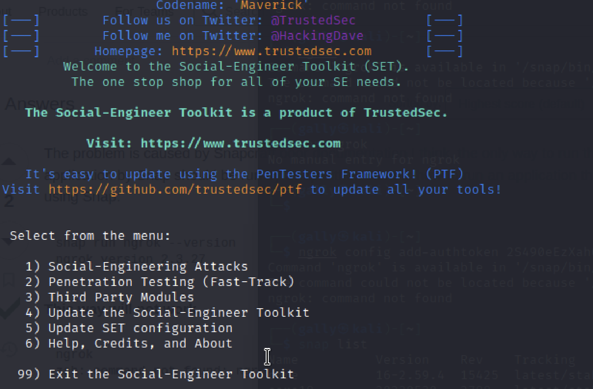
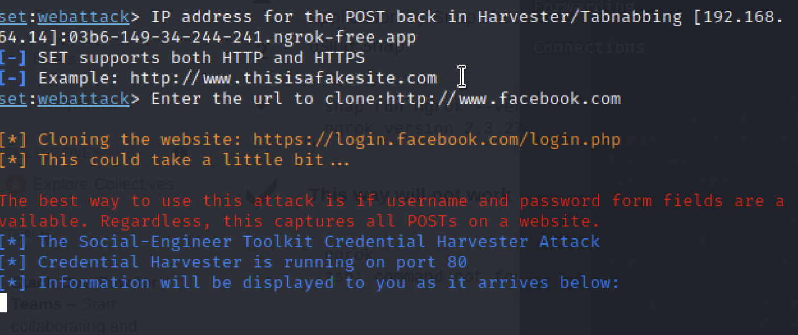
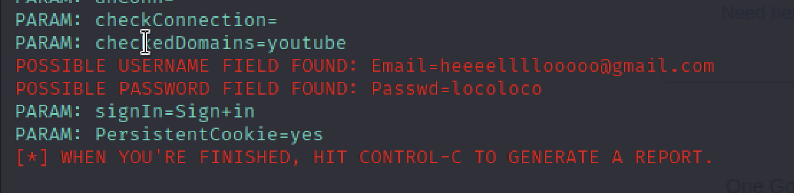
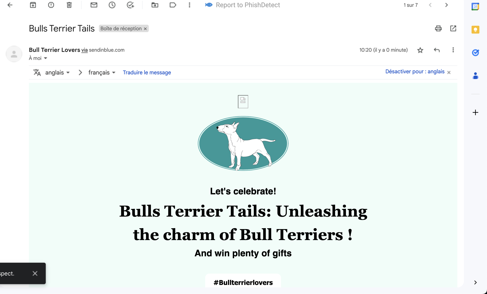

# Let's go Phishing

    Mode : Solo
    Duration : 4 days
    
## Challenge

  Bob has a dog (a bull terrier) named "Shimi". Bob really loves his dog.
  Alice is a fan of Mécanique. She has two vintage cars and often likes to parade around with her ancestral objects.
Your mission will be to obtain Alice's or Bob's password

## Phishing Project

Engaging Social Media Presence: Establish an active presence on social media platforms such as Instagram, Facebook, and Twitter. Share high-quality photos and videos of Bull Terriers in various settings, showcasing their personality and charm. Encourage victime to share their own Bull Terrier stories and images, fostering a sense of community.

## Newsletter template

## Using Kali Linux (VM)

# Installation Ngrok

I created an account

Installing Ngrok via Snap  
**Troubleshooting:** I couldn't install it with apt packages manager so I was forced to use snap

	snap install ngrok
	
	snap run ngrok config add-authtoken <token>
## Setoolkit

I read this article to have a little idea about how it works [Phishing Attack](https://www.cybervie.com/blog/phishing-attack-using-kali-linux/)

Gathered a few information about the setoolkit.

	Option 1) Social-Engineering Attacks
	Option 2) Website attack vectors
	Option 3) Credential Harvester Attack Method
	Option 2) Site cloner 
	
## Ngrok configuration

Start a tunnel
	
	snap run ngrok http 80	
	
Connecting Ngrok forwarding with setoolkit

	copy the forwarding into my setoolkit 
	
**The phishing website works**
	

##Sendinblue

## Troubleshooting

Tried with setoolkit but didn't work the SMTP service.  

So I finally sent it via Sendinblue, Not ideal because  too much personal information like your mobile phone etc...

##Alternatives

[https://getgophish.com/](https://getgophish.com/)
GoPhish could be a good altertive to this problem to have my own service 

[https://github.com/mailhog/MailHog
](https://github.com/mailhog/MailHog) MailHog for STMP MailHog is an email testing tool for developers: Configure your application to use MailHog for SMTP delivery

