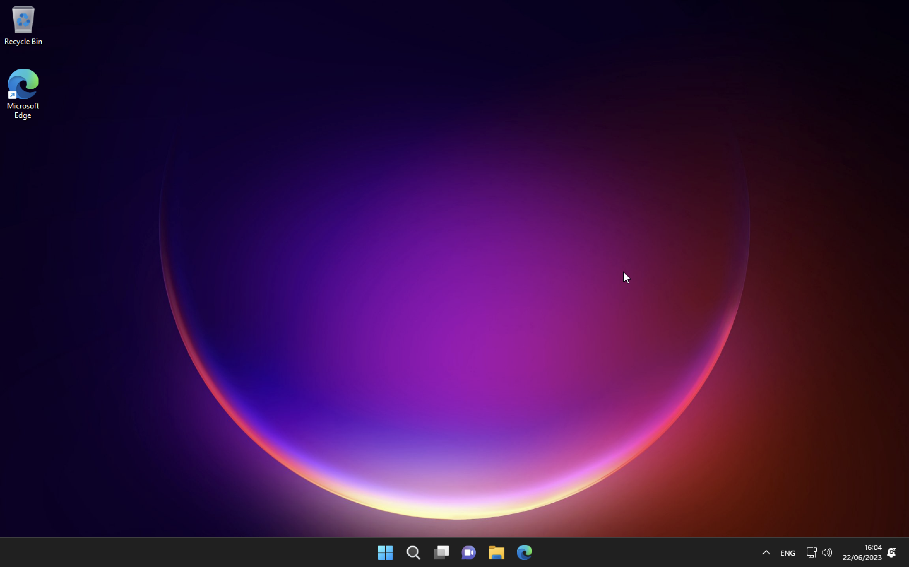

# Windows Installation VM (UTM) on APPLE Silicon ARM64/M2

macOS
-----
macOS requires [Homebrew](https://brew.sh) to install the prerequisite software.
After Homebrew was installed, you can install the requirements using:

```bash
brew tap sidneys/homebrew
brew install cabextract wimlib cdrtools sidneys/homebrew/chntpw
```

Download Windows 11 ARM64 via UUPD

[Windows 11 UUPDUMP](https://uupdump.net/known.php?q=22621.674) 

Executable : 	``chmod +x uup_download_macos.sh``

Run ``./uup_download_macos.sh``

Installing some prerequisites for Apple M2 Silicon

	$ /bin/bash -c "$(curl -fsSL https://raw.githubusercontent.com/Homebrew/install/master/install.sh)"
	$ brew tap sidneys/homebrew
	$ brew install aria2 cabextract wimlib cdrtools sidneys/homebrew/chntpw


Taps are external sources of Homebrew formulae, casks and/or external commands. They can be created by anyone to provide their own formulae, casks and/or external commands to any Homebrew user.

### Troubleshooting with chntpw 
External solution for Apple M2 

GitHub repository : 

[minacle/chntpw](https://github.com/minacle/chntpw)

[minacle/homebrew-chntpw](https://github.com/minacle/homebrew-chntpw)
	
	brew tap minacle/chntpw
	brew install minacle/chntpw/chntpw
	
chntpw is a software utility for resetting or blanking local passwords used by Windows NT operating systems on Linux. It does this by editing the SAM database where Windows stores password hashes. 	
	
### Networking 

Need to install the SPICE guest tools, which includes the network drivers.	
	
	
	